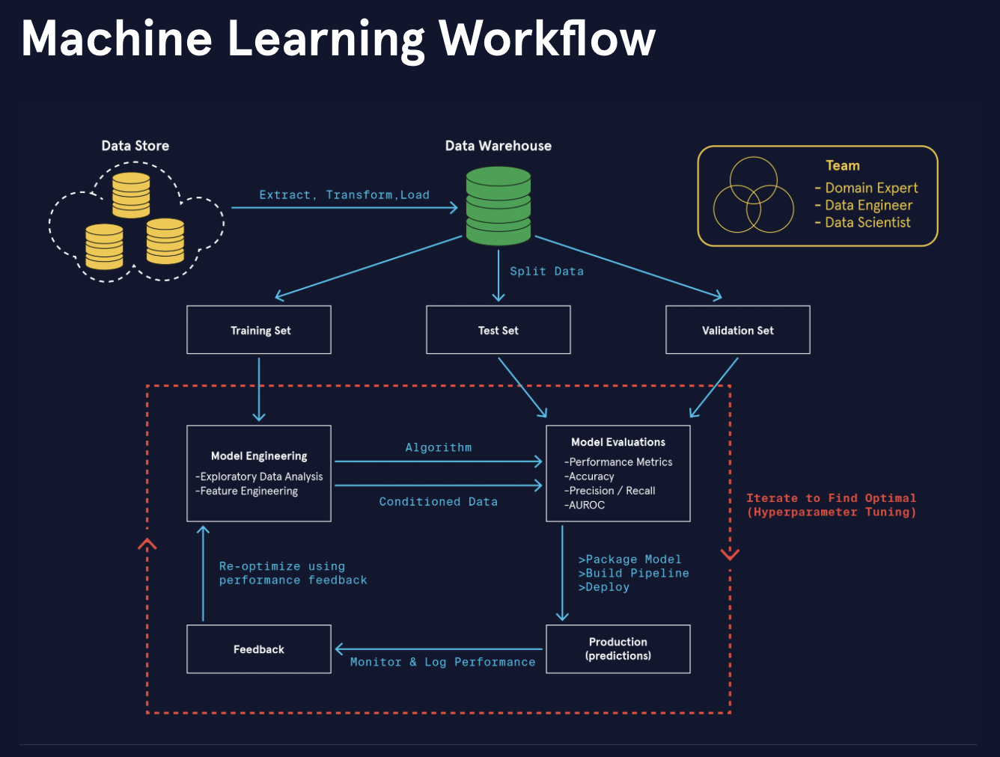

Project Neo

# AI/ML/LLM Software Engineering
This portfolio demonstrates end-to-end expertise in **Artificial Intelligence (AI)**, **Machine Learning (ML)**, and **Large Language Models (LLMs)** through production-ready data pipelines, algorithms, evaluation functions, and scalable infrastructure. It is written in **Python** and designed to highlight practical engineering skills for **enterprise clients** seeking advanced, reproducible AI/ML/LM solutions to drive business value and revenue.

[Image courtesy of Codecademy](https://www.codecademy.com)

# Value Proposition🪙
- Quality. Ensures high model accuracy, robustness, and reliability. 
- Variety. A vast library of algorithms supports rigorous mathematical and scientific analysis, adaptable to nearly every field of study.
- Reduced Costs. Efficient model design, optimized infrastructure, and smart data usage lowers analysis, file storage, and maintenance expenses, making AI solutions more scalable and sustainable.
- Saved Time. Automate repetitive/required tasks. Streamline product research & development. 
- Simplicity. Plain language, clear systems architecture with modular design, and intuitive user interfaces reduce complexity. 
- Information. Data and insights from models enable better decision-making, pattern recognition, utilization, and creation, and a differentiated competitive advantage.

# Table of Contents📖
- [Value Proposition](#value-proposition)
- [Features](#features)
- [Tech Stack](#tech-stack)
- [Prerequisites](#prerequisites)
- [Enterprise Use Cases](#enterprise-use-cases)
- [License](license.txt)
- [Contact](#contact)
- [Acknowledgements](#acknowledgements)

# Features✨
- **Data Pipelines**:  
  - Ingestion from API, JSON, and CSV endpoints  
  - Data cleaning, transformation, and feature engineering  
  - Scalable workflows for big datasets (filtering, mapping, reducing, and sorting functions)

- **Algorithms**:  
  - Bayes' theorem, posterior probabilities, probabalistic inference 
  - Evolutionary algorithms, fitness functions, genetic search 
  - Logic, accuracy, deduction 
  - Neural networks, gradient descent (backpropogation), squared error 
  - Support vector machines, margin, constrained optimization 
  - Decision Trees 
  - K-Means Clustering 
  - K-Nearest Neighbor 
  - Linear Regression 
  - Logistic Regression 
  - Multiple Linear Regression 
  - Naive Bayes Classifier 
  - Random Forests 
  - Dimensionality Reduction (PCA)
  - Custom AI/ML/LLM model implementations tailored to enterprise use cases  
  - Deep learning (NLP, computer vision, time-series models)  

- **Evaluation Functions**:  
  - Accuracy, precision, recall, F1
  - Business-aligned OKRs/KPIs
  - Fitness functions
  - Margin 
  - MSE, squared error, R^2
  - Posterior probabilities 

- **Infrastructure**:  
  - Modular architecture with reusable components  
  - CI/CD readiness (GitHub)  
  - Cloud-agnostic design (Azure, AWS, GC)  

# Tech Stack🛠
- **Languages**: Python, Bash
- **Libraries**: NumPy, Pandas, PyTorch, Scikit-learn, TensorFlow, XGBoost
- **DevOps**: GitHub 
- **UX/UI Visualization**: CSS3, HTML5, Kotlin, Matplotlib, Plotly, Seaborn, Swift

# Prerequisites
Python 3.10+

# Enterprise Use Cases📈
- [Asset allocation](https://www.testandi.com): Predict the optimal weights of a diversified investment portfolio of equities for the highest Sharpe ratios. 
<!-- - Classification: Image classification of similar images. -->
<!-- - Click Through Rates: UX/UI design features correlated with increased customer engagement and advertising click through rates. --> 
<!-- - Customer Churn Prediction: Reduce revenue leakage by identifying at-risk clients. -->
- Earnings Per Share (EPS). Neural network tensor analysis of 10K financial statements, annual reports, return on equity (ROE), and return on invested capital (ROIC) to predict EPS.
- [Financial Wellness Scorecard](https://blackarsenic88.github.io/financial-wellness/): Comprehensive personal financial planning record for risk-management, short-term planning, and long-term planning that predicts retirement readiness while providing insights, guidance, and recommendations. 
<!-- Fraud Detection: Real-time monitoring of financial transactions with anomaly detection. -->
- [Honey Production](https://blackarsenic88.github.io/agriculture/):  Timely, accurate, and useful statistics in service of U.S. agriculture production. 
<!-- - Hospitality: Food & drink classification of nutrient density scores, powerhouse fruits and vegetables, and superfoods. --> 
- [Housing prices](https://blackarsenic88.github.io/real-estate/): Regression model to forecast fair market prices and rents. 
- [Large Language Models](https://blackarsenic88.github.io/ai-assistant/): Seamlessly integrate and fine tune AI language models like OpenAI's ChatGPT into your enterprise websites and mobile apps and reduce customer service costs. 
<!-- - Libraries: Classification of books, Great Books, Classics, the Canon, and Hypercanon. -->
<!-- - Natural Language Processing: Classify text to determine user sentiment in product/service reviews and user likelihood to recommend. --> 
<!-- - Recommendation Systems: Personalized content and product suggestions for websites, mobile apps, and e-commerce. --> 
<!-- - [Sports Metrics](https://blackarsenic88.github.io/fantasy-sports/): Predict the outcome for an athlete based on their playing habits. --> 
<!-- - [Subscription Services](https://blackarsenic88.github.io/engagement/): Streaming platforms and content creators can leverage data-driven insights such as listen time, watch time, views, likes, shares, and other engagement metrics to anticipate subscriber growth, optimize marketing spend, and improve retention strategies. -->
<!-- - Supply & Demand: Forecast capacity to eliminate DOWNTIME and reduce waste. -->

# License⚖️
This project is licensed under a dual license. You are free to use, modify, and distribute this software with attribution for personal or research use, but must open source modifications to the community. Integration into closed source, commercial proprietary systems requires a low cost annual subscription and license fees. See license.txt for details. 

# Contact📬
- Are you ready for production-ready pipelines and infrastructure to evolve your business?
- Looking for customizable modules that can be adapted to specific business problems?
- Do you need proven scalability and revenue impact, all aligned with enterprise-grade standards, KPIs/OKRs, and real-world use cases? 
- For enterprise consulting, partnerships, or custom AI/ML software engineering solutions contact:
- Name: Abraham Doe, 
- Email: abrahamdoe@gmail.com
- LinkedIn: [Profile](https://linkedin.com/in/abraham-doe-994b3837a)
- GitHub: [Portfolio](https://github.com/BlackArsenic88?tab=repositories)

# Acknowledgements🙏
- Dr. Pedro Domingos, Dr. Ryan Ahmed, Dr. Christian Mayer, Dr. Ebony Thomas, Dr. Gary Calore, and Asabeneh Yetaveh  
- Scikit-learn for robust AI/ML utilities
- UC Irvine, Kaggle, and other datasets for training data
- Open-source contributors and the SWE research community
- Inspiration from industry leaders in AI/ML models
- I am grateful. Thank you! 

